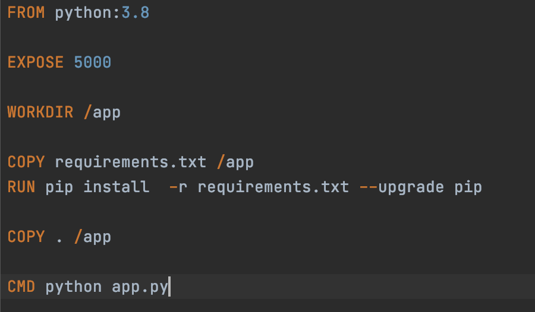
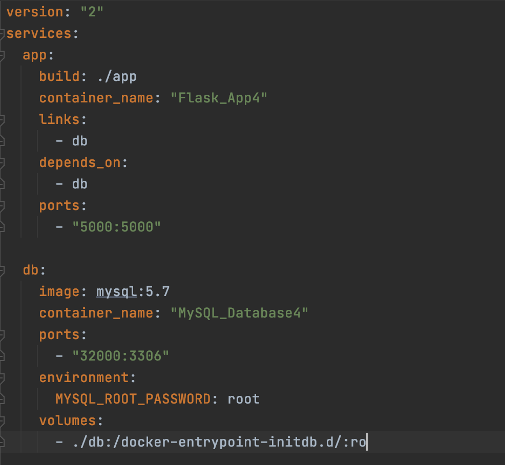
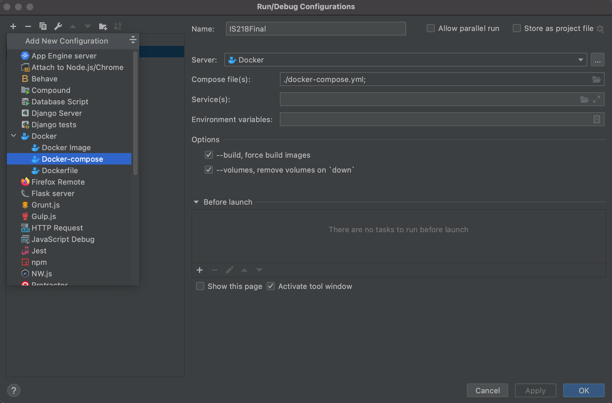
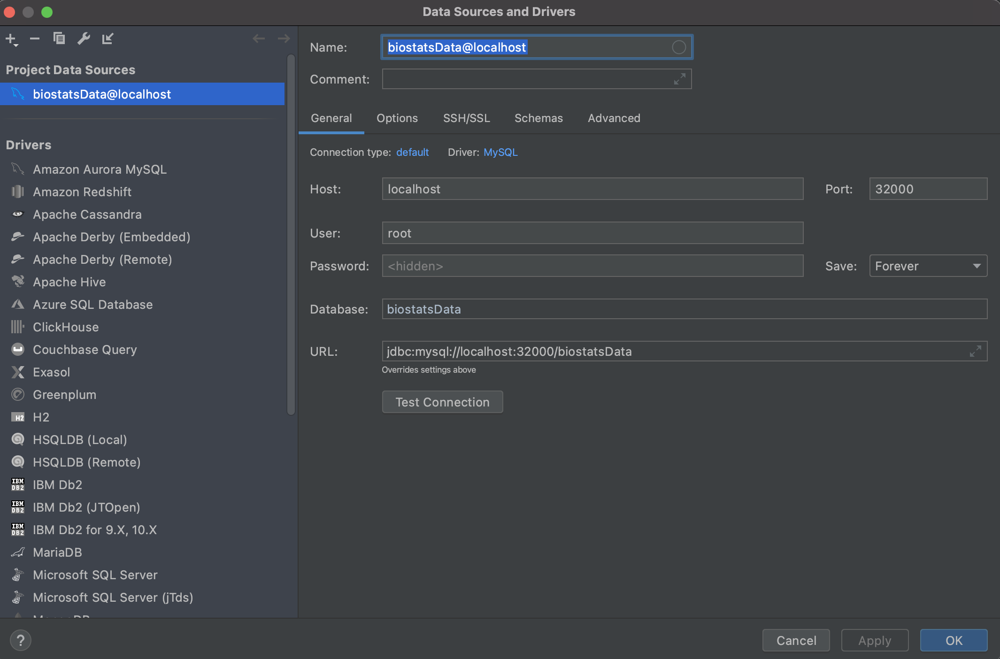
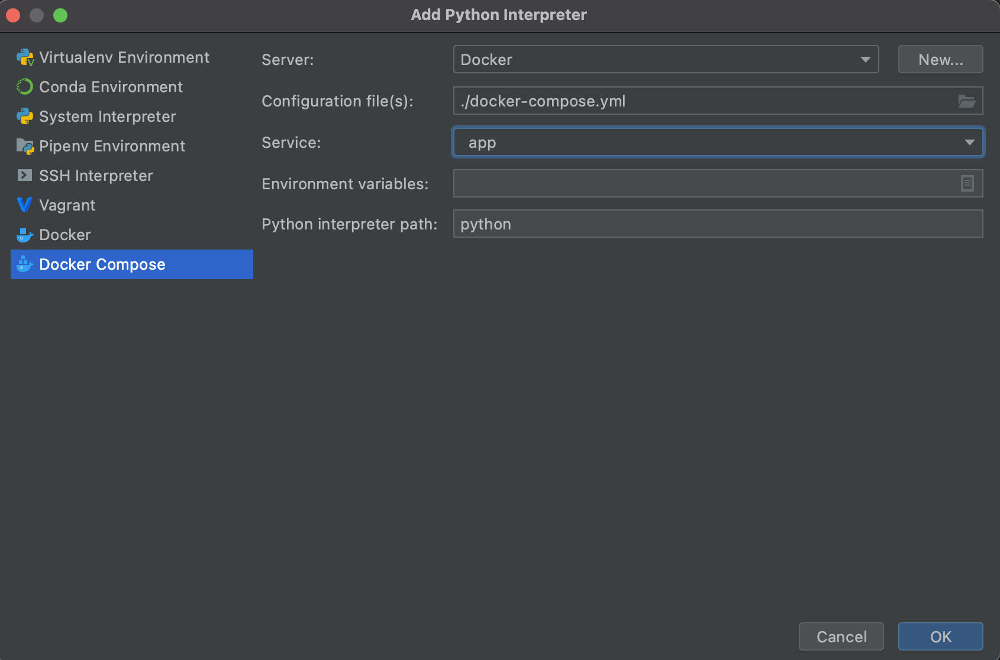

# IS218 FINAL PROJECT - BIOSTATS

1. TEAM:
    * Hannah Benjamin
    * Orville Dillon
    
2. FEATURES ADDED:
    * OAuth Feature - Orville Dillon
    * Google Calendar - Hannah Benjamin
    
# DOCKER INSTRUCTIONS

1. Code for Dockerfile:

   
2. Code for Docker compose file:

3. Add configuration for docker compose:

   
4. Go to View > Tool Windows > Database to add data source:

   
5. Edit remote interpreter settings:

   